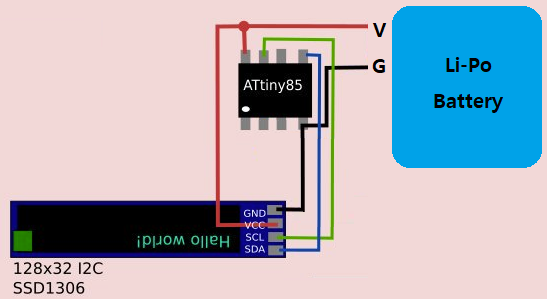
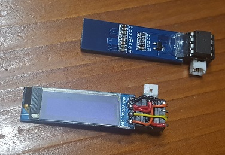
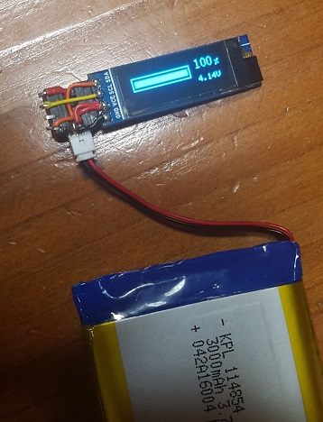

# tiny_batmon

Tiny Battery monitoring for ATtiny85 &amp; OLED

---

Tiny Battery Level Checker.
Its purpose is to make it with a minimum number of parts at a low cost. It was made using attiny85 and oled.

## wiring diagram

## product picture

## test look

---

## repository
  * https://github.com/amos42/tiny_batmon

## build profile
  * ATtiny85 (profile: https://raw.githubusercontent.com/damellis/attiny/ide-1.6.x-boards-manager/package_damellis_attiny_index.json)

## dependency
  * Wire (default)

---

## reference 

I referred to the following sources for OLED control.

> https://github.com/datacute/Tiny4kOLED
